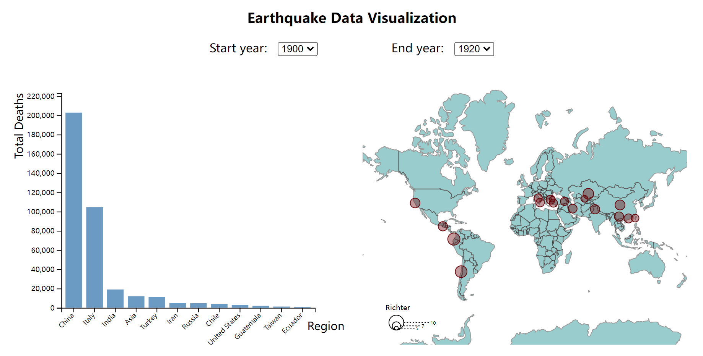
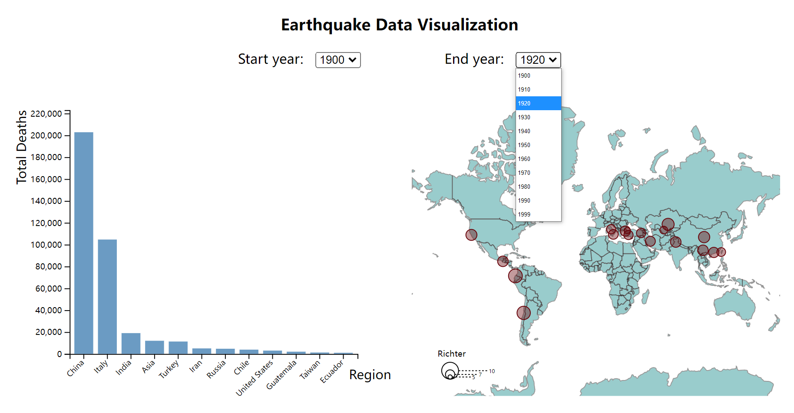
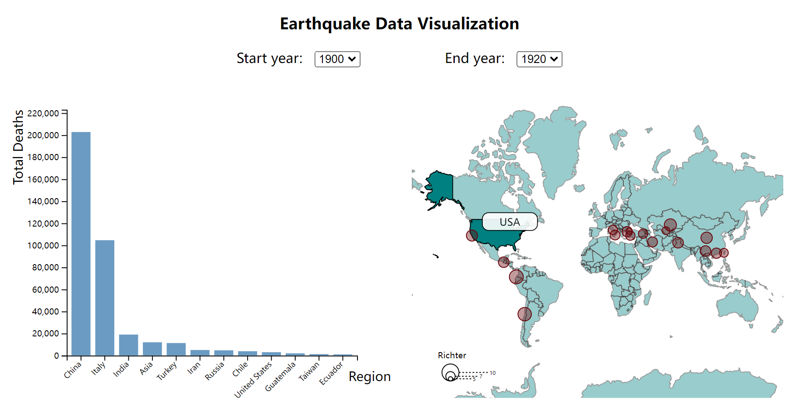

# Earthquakes-Data-Visualization
Created interactive data visualizations for global earthquake data from 1900 to 1999.

This Project is hosted on VizHub. Play it by yourself! Here's the link: [Earthquakes-Data-Visualization](https://vizhub.com/Junying-Li/b7235be55f544d108affb47ca80fbb16?edit=files&file=index.html&mode=full)

## Screenshots

*FIgure-1 Overview*

*Figure-2 Drop-down Menus*

*Figure-3 Tooltips*
